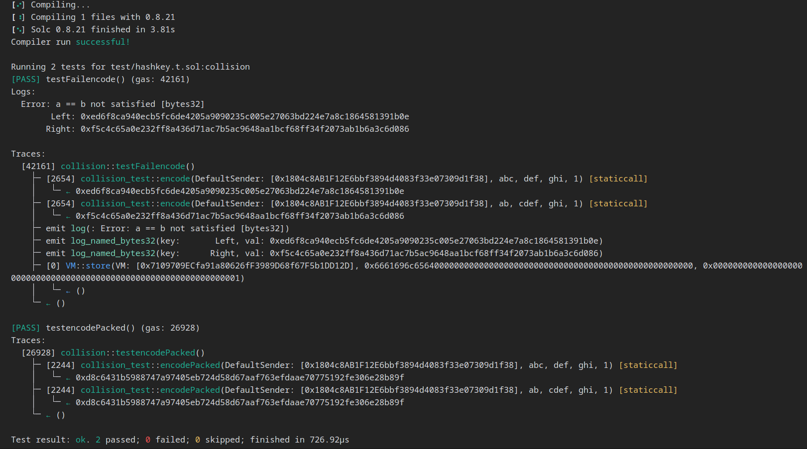

## Title: incorrect use of abi.encodePacked leads to hash collisions

### Description

#### Intro
In Did.sol ,abi.encodePacked() encoder function is used with dynamic type arguments in multiple functions this leads to hash collisions

#### vulnerability details

In Did.sol i found that , abi.encodePacked() is used to encode the different parameters in multiple functions.here while using abi.encodePacked() arguments passed are of dynamic types which crafts hash collisions.below are the functions using abi.encodePacked() with dynamic type arguments

```
function issueDG(string memory _name, string memory _symbol, string memory _baseUri, bytes memory _evidence, bool _transferable) public {
        require( !_evidenceUsed[keccak256(_evidence)] && _validate(keccak256(abi.encodePacked(msg.sender, _name, _symbol, _baseUri, block.chainid)), _evidence, signer), "invalid evidence");
        _evidenceUsed[keccak256(_evidence)] = true;
        bool success;
        bytes memory data;
        (success, data) = dgFactory.delegatecall(
            abi.encodeWithSignature(
                "issueDG(string,string,string,bool)",
                _name,
                _symbol,
                _baseUri,
                _transferable
            )
        );
        require(success, "issueDG failed");
        address DGAddr = abi.decode(data, (address));
        deedGrainAddrToIssuer[DGAddr] = msg.sender;
        emit IssueDG(msg.sender, DGAddr);
    }

```

```
function issueNFT(string memory _name, string memory _symbol, string memory _baseUri, bytes memory _evidence, uint256 _supply) public {
        require(!_evidenceUsed[keccak256(_evidence)] && _validate(keccak256(abi.encodePacked(msg.sender, _name, _symbol, _baseUri, block.chainid)), _evidence, signer), "invalid evidence");
        _evidenceUsed[keccak256(_evidence)] = true;
        bool success;
        bytes memory data;
        (success, data) = dgFactory.delegatecall(
            abi.encodeWithSignature(
                "issueNFT(string,string,string,uint256)",
                _name,
                _symbol,
                _baseUri,
                _supply
            )
        );
        require(success, "issueDGNFT failed");
        address DGNFTAddr = abi.decode(data, (address));
        deedGrainAddrToIssuer[DGNFTAddr] = msg.sender;
        emit IssueNFT(msg.sender, DGNFTAddr);
    }

```
```
function claimDG(
        address DGAddr,
        uint256 tokenId,
        bytes memory data,
        bytes memory evidence
    ) public {
        require(
            !_evidenceUsed[keccak256(evidence)] &&
                _validate(
                    keccak256(abi.encodePacked(msg.sender, DGAddr, tokenId, data, block.chainid)),
                    evidence,
                    signer
                ),
            "invalid evidence"
        );
        _evidenceUsed[keccak256(evidence)] = true;
        IDeedGrain DG = IDeedGrain(DGAddr);
        DG.mint(msg.sender, tokenId, data);
    }

```

in the abovel functions abi.encodePacked() is used with dynamic type arguments which crafts hash collisions.If you use keccak256(abi.encodePacked(a, b)) and both a and b are dynamic types, it is easy to craft collisions in the hash value by moving parts of a into b and vice-versa. More specifically, abi.encodePacked("a", "bc") == abi.encodePacked("ab", "c")

#### Impact

depending on the functions,it may vary but in all the above functions hash collisions is possible.

### Proof Of Concept

below is the POC for vulnerability written in foundry

```
// SPDX-License-Identifier: MIT
pragma solidity ^0.8.21;

import "forge-std/Test.sol";
import "forge-std/console.sol";


contract collision_test {

    function encodePacked(address sender,string memory _name, string memory _symbol, string memory _baseUri,uint chainId) public pure returns(bytes32) {
        bytes32 message = keccak256(abi.encodePacked(sender,_name,_symbol,_baseUri,chainId));
        return message;
    }

    function encode(address sender,string memory _name, string memory _symbol, string memory _baseUri,uint chainId) public pure returns(bytes32) {
        bytes32 message = keccak256(abi.encode(sender,_name,_symbol,_baseUri,chainId));
        return message;
    }


}


contract collision is Test{
    collision_test private target;

    function setUp() public{
        target = new collision_test();
    }

    string _name1 = "abc";
    string _symbol1 = "def";
    string _baseUri1 = "ghi";
    uint chainId = 1;

    string _name2 = "ab";
    string _symbol2 = "cdef";
    string _baseUri2 = "ghi";


    function testencodePacked() public { //passing test

        bytes32 hash1 = target.encodePacked(msg.sender,_name1,_symbol1,_baseUri1,chainId);

        bytes32 hash2 = target.encodePacked(msg.sender,_name2,_symbol2,_baseUri2,chainId);


        assertEq(hash1,hash2);

    }

    function testFailencode() public { //failing test
        bytes32 hash1 = target.encode(msg.sender,_name1,_symbol1,_baseUri1,chainId);

        bytes32 hash2 = target.encode(msg.sender,_name2,_symbol2,_baseUri2,chainId);

        assertEq(hash1,hash2);


    }


}

```

below is output of the test



#### Solution

always use `abi.encode()` instead of `abi.encodePacked()`while encodeing dynamic type parameters.test for `abi.encode()` is also included in the above POC