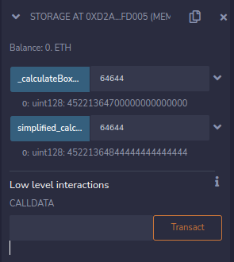
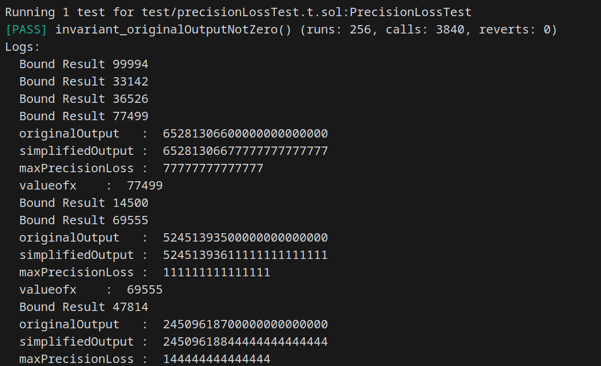
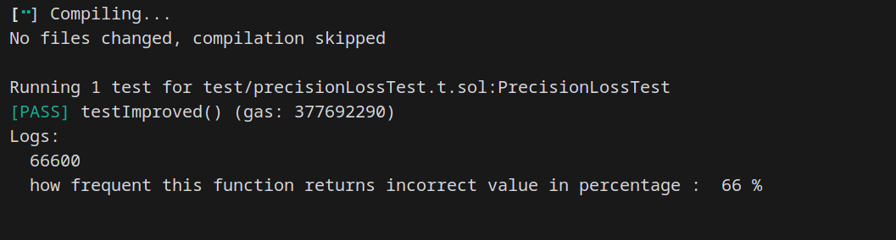

## Title: precision loss in _calculateBoxPrice() function leads to loss of funds    

### severity
 Med

### Description

#### Intro

due to precision loss in in both the contracts i.e [Box.sol](https://explorer.zksync.io/address/0xD746aE5e6E43e3B6a2c7bD18B60760E0861523F9#contract) and [BoxMaintest20.sol](https://explorer.zksync.io/address/0x2D85ec05893d33C32ccAb97CDd17E512033ebDAD#contract) _calculateBoxPrice() function it returns incorrect value/precision loss value 66.66% of time.by carefully using this attacker can steal the funds


#### vulnerability details

in [Box.sol](https://explorer.zksync.io/address/0xD746aE5e6E43e3B6a2c7bD18B60760E0861523F9#contract) and [BoxMaintest20.sol](https://explorer.zksync.io/address/0x2D85ec05893d33C32ccAb97CDd17E512033ebDAD#contract) contract's _calculateBoxPrice() function is most important function or heart of the contracts as it calculates the price of the box for trading/buying/selling of the boxes and it tries to prevent the malicious trades.but in _calculateBoxPrice() function i found a precision loss Vulnerability, where it returns 66.66666667% of time incorrect/precision loss price it means for every 10 call's to _calculateBoxPrice() function it returns incorrect or precision loss values to 6~7 call's.

below is the Vulnerable code
```
function _calculateBoxPrice(uint128 x) internal pure returns (uint128) {
        if (x <= 100) return PER_BOX_PRICE;

        uint128 boxPrice = 100;
        unchecked {
            if (x > 1000) {
                boxPrice = (x - 1000) ** 2 / 9 + 100 * (x - 100) / 3 + 100;
            } else {
                boxPrice = 100 * (x - 100) / 3 + 100;
            }
        }
        return boxPrice * 1e14;
    }


```
this function returns the price of the box and it is designed in such a way that for x smaller than >=100 it returns the PER_BOX_PRICE and for 101<x<1000 price increases linearly as x increases(`boxPrice = 100 * (x - 100) / 3 + 100;`) and for greater than 1000 i.e x>1000 the price is calculated as `(x - 1000) ** 2 / 9 + 100 * (x - 100) / 3 + 100`. This is a quadratic function that increases more rapidly as x increases.but due to the integer division operations like `/ 3` and `/ 9`. If the numerator is not a multiple of the denominator, the remainder is discarded as the EVM does not support floating-point arithmetic.

not attaching the affected functions as almost all the non Admin functions in the both the Box.sol and BoxMaintest20.sol are affected.

#### Impact

loss to contract/protocol funds and using this Vulnerability attacker can steal the funds without affecting the contract's(exploits attached in references)

### Proof Of Concept

below is the detailed POC describing this Vulnerability using Foundry,Remix and (Full precision calculator)[https://www.mathsisfun.com/calculator-precision.html] *this POC has two parts,in first i have proved how the simplified/corrected function returns precise value using remix and Full precision calculator and second part is the invarient testing using foundry. part-A:

```
// SPDX-License-Identifier: GPL-3.0

pragma solidity >=0.8.2 <0.9.0;

contract Storage {
    address owner;
    uint128 PER_BOX_PRICE = 0.01 ether;
    constructor(){
        owner = msg.sender;
    }

    function _calculateBoxPrice(uint128 x) public view returns (uint128) {//@audit precision loss
        if (x <= 100) return PER_BOX_PRICE;

        uint128 boxPrice = 100;
        unchecked {
            if (x > 1000) {
                boxPrice = (x - 1000) ** 2 / 9 + 100 * (x - 100) / 3 + 100;//precision loss as it is dividing by 9 and 3 the numbers which are not multiple of this gets remainder.
            } else {
                boxPrice = 100 * (x - 100) / 3 + 100;
            }
        }
        return boxPrice * 1e14;
    }
    function simplified_calculateBoxPrice(uint128 x) public view returns (uint128) {
        if (x <= 100) return PER_BOX_PRICE;

        uint128 boxPrice = 100;
        unchecked {
            if (x > 1000) {
                boxPrice = (x - 1000) ** 2 *9 / 9 + 100 * (x - 100) *9/ 3 + 100*9;//precision loss as it is dividing by 9 and 3 the numbers which are not multiple of this gets remainder and as expected precision loss for x=1003 precision loss is 0.6667
            } else {
                boxPrice = 100 * (x - 100) *9 / 3 + 100*9;//for x = 999 it returns 30066 instead of 30066.6667 loss of 0.6667 in eth 0.0000667 in usd 0.15$
            }
        }
        return boxPrice * 1e14/9;
    }

}

```
above function is the simplified or improved function of _calculateBoxPrice() funciton.as mentioned in the comments of the above function i have multiplied both the equations with 9 as it is the multiple of both the 9 and 3.due to this, this function provides the exact price with precision loss.(tested below)

let say x=64644 using the full precision calculated we get

i.e 45221364844444444444444 this is the actual value we should get

now the same x,using remix ide



as shown in the image the original function _calculateBoxPrice(uint128 x) returns 45221364700000000000000 and the simplified_calculateBoxPrice(uint128 x) returns 45221364844444444444444 here the actual price calculated using full precision calculator and simplified_calculateBoxPrice(uint128 x) are exactly same and here the difference or precision loss can be significant high depending upon the value of x

part-B:tests using foundry PrecisionLoss contract

```
// SPDX-License-Identifier: MIT
pragma solidity ^0.8.18;

contract PrecisionLoss {
    uint128 PER_BOX_PRICE =0.01 ether;

    function original_calculateBoxPrice(uint128 x) public view returns (uint128) {//@audit precision loss
        if (x <= 100) return PER_BOX_PRICE;

        uint128 boxPrice = 100;
        unchecked {
            if (x > 1000) {
                boxPrice = (x - 1000) ** 2 / 9 + 100 * (x - 100) / 3 + 100;//precision loss as it is dividing by 9 and 3 the numbers which are not multiple of this gets remainder and as EVM does not support floating-point arithmetic leads to precision loss
            } else {
                boxPrice = 100 * (x - 100) / 3 + 100;
            }
        }
        return boxPrice * 1e14;
    }

    function simplified_calculateBoxPrice(uint128 x) public  view returns (uint128) {//@audit precision loss
        if (x <= 100) return PER_BOX_PRICE;

        uint128 boxPrice = 100;
        unchecked {
            if (x > 1000) {
                boxPrice = (x - 1000) ** 2*9 / 9 + 100 * (x - 100) *9/ 3 + 100*9;//to avoid precision loss it can be multiplied with multiples of both 3 and 9. here by multiplying with 9 the output will be accurate without precision loss...
            } else {
                boxPrice = 100 * (x - 100)*9 / 3 + 100*9;
            }
        }
        return boxPrice * 1e14/9;
    }
}


```
PrecisionLossHandler contract

```
// SPDX-License-Identifier: MIT
pragma solidity ^0.8.20;

import {PrecisionLoss} from "../src/PrecisionLoss.sol";

import {console2} from "forge-std/console2.sol";
import {CommonBase} from "forge-std/Base.sol";
import {StdUtils} from "forge-std/StdUtils.sol";

contract PrecisionLossHandler is CommonBase, StdUtils {
    //PrecisionLoss contract being tested
    PrecisionLoss internal _underlying;

    // invariant variables, set to 1 as the invariant will
    // be errorOutput != 0, so don't want it to fail immediately
    uint128 public originalOutput   = 1;
    uint128 public simplifiedOutput = 1;

     // optimized finding variables
    uint public maxPrecisionLoss;
    uint public valueOf_x;

    constructor(PrecisionLoss underlying) {
        _underlying = underlying;
    }

    function _calculateBoxPrice(uint128 x) public {
        // constrain inputs between 101 & 100000 in their respective
        // precision ranges
        //no need to check below 101 as it returns PER_BOX_PRICE i.e 0.01 ether
        x = uint128(bound(x,101,100000));

        originalOutput = _underlying.original_calculateBoxPrice(x);
        simplifiedOutput = _underlying.simplified_calculateBoxPrice(x);

         // difference in precision loss
        uint precisionLoss = simplifiedOutput - originalOutput;

        if(precisionLoss > 0) {
            if(precisionLoss > maxPrecisionLoss ||
                (precisionLoss == maxPrecisionLoss
              && originalOutput == 0 && simplifiedOutput > 0)) {
                maxPrecisionLoss = precisionLoss;
                valueOf_x = x;

                console2.log("originalOutput   : ", originalOutput);
                console2.log("simplifiedOutput : ", simplifiedOutput);
                console2.log("maxPrecisionLoss : ", maxPrecisionLoss);
                console2.log("valueofx    : ", x);

            }
        }
    }
}


```

PrecisionLossTest contract

```
// SPDX-License-Identifier: MIT
pragma solidity ^0.8.20;

import {PrecisionLoss} from "../src/PrecisionLoss.sol";
import {PrecisionLossHandler} from "./PrecisionLossHandler.sol";

import {console2} from "forge-std/console2.sol";
import {Test} from "forge-std/Test.sol";

contract PrecisionLossTest is Test {
    // real contract
    PrecisionLoss  internal _underlying;
    // handler which exposes real contract
    PrecisionLossHandler internal _handler;

    function setUp() public {
        _underlying = new PrecisionLoss();
        _handler    = new PrecisionLossHandler(_underlying);

        // invariant fuzz target _handler contract
        targetContract(address(_handler));

        // functions to target during invariant tests
        bytes4[] memory selectors = new bytes4[](1);
        selectors[0] = _handler. _calculateBoxPrice.selector;

        targetSelector(FuzzSelector({
            addr: address(_handler),
            selectors: selectors
        }));
    }
    function invariant_originalOutputNotZero() public view {
        assert(_handler.originalOutput() != 0);
    }

    function testImproved() public view{
        //this test function shows how much percent the original function returns incorrect value or precision loss value
        uint128 unmatchcount=0;
        uint128 matchcount = 0;
        //range 101 to 100001, no need to check below 101 as it retuns default PER_BOX_PRICE i.e 0.01 ether
        for(uint128 i = 101;i<100001;i++){
            if(_underlying.original_calculateBoxPrice(i)!=_underlying.simplified_calculateBoxPrice(i)){
                    unmatchcount++;
            }else{
                matchcount++;
            }
        }
        console2.log(unmatchcount);
        console2.log("how frequent this function returns incorrect value in percentage : ",(unmatchcount)*100/(100001-101),"%");
        //being precise 66.66% of the time _calculateBoxPrice function is returning incorrect value/inaccurate value
        //aslo for the range of 101 to 10000 the original function returns incorrect value with accuracy of 66.66666667%,which can also be told that, for every 10 call's to _calculateBoxPrice() function it returns incorrect or precision loss values to 6~7 call's
    }
}

```

by forge test --match-test invariant_originalOutputNotZero -vvvv we get the originalOutput , simplifiedOutput and maxPrecisionLoss



- *and still here PrecisionLoss can be high depending on the value of x as here in invariant testing it test for random x

here the below test shows how much percent the original function returns incorrect value or precision loss value

by `forge test --match-test testImproved -vvv`



we can tell that for every 10 call's to _calculateBoxPrice() function it returns incorrect or precision loss values to 6~7 call's