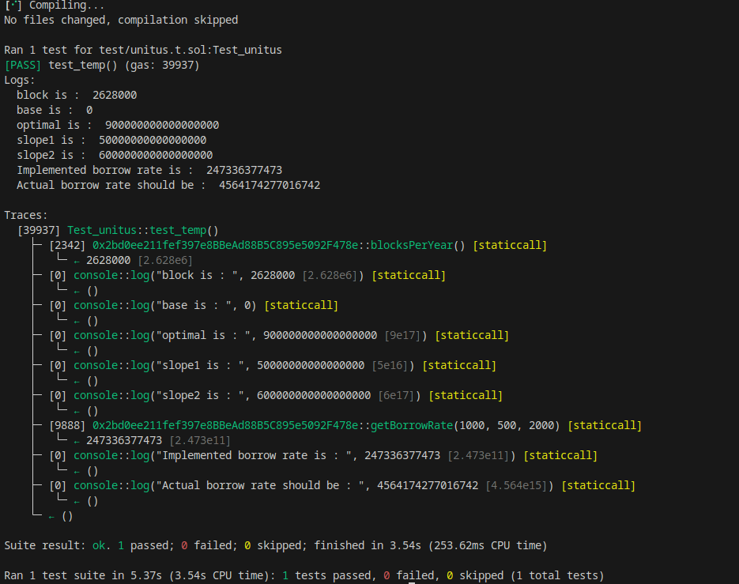

## Title: Incorrect Utilization Rate Calculation Leads to Inaccurate Borrow Rate in getBorrowRate() Function

### Description

In `stablePrimaryInterestModel` i.e in `InterestRateModelV2` contract,i found out

The `utilizationRate()` function contains a logical flaw/protocol insolvency issue that can lead to incorrect utilization rate calculations. This flaw directly impacts the `getBorrowRate` function and all the contracts which imports/inheritates this contract, resulting in inaccurate borrow rate calculations.

utilization rate is [**link**](https://hackenproof.com/redirect?url=https://tokeninsight.com/en/tokenwiki/all/what-is-utilization-rate%23:~:text=Utilization%25C2%25A0Rate%2520%253D%2520Total,pool%2520is%252080%2525.)

 `Utilization Rate = Total Borrows / Total Liquidity`

i.e if $8 million out of a $10 million lending pool is being borrowed, then the utilization rate of this pool is 80%

and A higher utilization rate indicates strong demand for loans from the market, resulting in a supply shortage in the pool

below is the `utilizationRate()` function implemented in `InterestRateModelV2` contract :
```
 function utilizationRate(
        uint256 _cash,
        uint256 _borrows,
        uint256 _reserves
    ) internal pure returns (uint256) {
        // Utilization rate is 0 when there are no borrows
        if (_borrows == 0) return 0;

        // Utilization rate is 100% when _grossSupply is less than or equal to borrows
        uint256 _grossSupply = _cash.add(_borrows);
        if (_grossSupply <= _reserves) return ONE;//@audit incorrect implementation

        // Utilization rate is 100% when _borrows is greater than _supply
        uint256 _supply = _grossSupply.sub(_reserves);//@audit assumes _reserves<=_cash+_borrows incorrect implementation
        if (_borrows > _supply) return ONE;

        return _borrows.rdiv(_supply);
    }
```
link to above funtion : [**link**](https://hackenproof.com/redirect?url=https://sepolia.etherscan.io/address/0x2bd0ee211fef397e8BBeAd88B5C895e5092F478e%23code)

here let's say:

_Cash: 1000 units

_Borrows: 500 units

_Reserves: 2000 units


now the implemented logic returns `utilizationRate = 100%` i.e

grossSupply = 1000+500=1500 and_reserves = 2000 now,due to `if (grossSupply <= _reserves) return ONE;` the implemented function returns 100%

but actually it Should/Must return

Utilization Rate = Total Borrows / Total Liquidity

= 500 / 1000+2000 = 16.66%

this protocol insolvency directly effects the `getBorrowRate()` function.

`note` :attached foundry poc in the validation steps section

#### Impact

The incorrect utilization rate calculation leads to inaccurate borrow rates. This means that borrowers might be charged either too much or too little interest, which can affect the overall profitability and risk management of the platform.

### Proof Of Concept

```
// SPDX-License-Identifier: MIT AND UNLICENSED
pragma solidity ^0.8.0;

import {console2} from "forge-std/console2.sol";
import {Test} from "forge-std/Test.sol";


interface InterestRateModelV2 {
    function blocksPerYear() external view returns(uint256);
    function base() external view returns(uint256);
    function optimal() external view returns(uint256);
    function slope_1() external view returns(uint256);
    function slope_2() external view returns(uint256);
    function getBorrowRate(
        uint256 _balance,
        uint256 _borrows,
        uint256 _reserves
    ) external view returns (uint256 _borrowRate);
}

contract Test_unitus is Test{

    InterestRateModelV2 public intrest_contract;
        uint ONE = 1e18;
    uint blocksPerYear;  
    uint base;
    uint optimal;
    uint slope_1;
    uint slope_2;

    function setUp() public{
        intrest_contract =  InterestRateModelV2(0x2bd0ee211fef397e8BBeAd88B5C895e5092F478e);
        blocksPerYear = intrest_contract.blocksPerYear();

        base = intrest_contract.base();

        optimal = intrest_contract.optimal();

        slope_1 = intrest_contract.slope_1();

        slope_2 = intrest_contract.slope_2();
    }


    function modified_UtilizationRate(uint256 _cash,uint256 _borrows,uint256 _reserves) public view returns(uint256){//this is modified or standard utilization Ratio function
         // Utilization rate is 0 when there are no borrows
        if (_borrows == 0) return 0;

        uint UtilRate = _borrows/_cash+_reserves;

        return UtilRate*ONE;
    }

    function getBorrowRate(
        uint256 _balance,
        uint256 _borrows,
        uint256 _reserves
    ) public view returns (uint256 _borrowRate) {
        uint256 _util = modified_UtilizationRate(_balance, _borrows, _reserves);
        uint256 _annualBorrowRateScaled = 0;

        // Borrow rate is:
        // 1). when Ur < Uoptimal, Rate = R0 + R1 * Ur / Uoptimal
        // 2). when Ur >= Uoptimal, Rate = R0 + R1 + R2 * (Ur-Uoptimal)/(1-Uoptimal)
        // R0: Base, R1: Slope1, R2: Slope2
        if (_util < optimal) {
            _annualBorrowRateScaled = base+(slope_1*_util)/optimal;//avoided pricison loss
        } else {
            _annualBorrowRateScaled = base+slope_1+slope_2*(_util-optimal)/(ONE-optimal);
        }

        // And then divide down by blocks per year.
        _borrowRate = _annualBorrowRateScaled/(blocksPerYear);
    }

    function test_temp() public view {
        uint block_per_year = intrest_contract.blocksPerYear();
        console2.log("block is : ",block_per_year);
        console2.log("base is : ",base);
        console2.log("optimal is : ",optimal);
        console2.log("slope1 is : ",slope_1);
        console2.log("slope2 is : ",slope_2);
        uint borrow_rate = intrest_contract.getBorrowRate(1000, 500, 2000);
        console2.log("Implemented borrow rate is : ",borrow_rate);
        uint borrow_actual = getBorrowRate(1000, 500, 2000);
        console2.log("Actual borrow rate should be : ",borrow_actual);

    }


}
```

- attached the output of the poc in png format

explanation:

Cash: 1000 units

Borrows: 500 units

Reserves: 2000 units

Blocks per Year: 2,628,000

Base: 0

Optimal: 0.9e18 (900000000000000000)

Slope1: 0.05e18 (50000000000000000)

Slope2: 0.6e18 (600000000000000000)

#### **Calculation with Current Implementation**

1. Utilization Rate Calculation:
    
    Gross Supply: 1000 + 500 =1500
    
    Condition Check: 1500 ≤ 2000
    
    1500≤2000 (This condition is true, so the function returns ONE which is 1e18 or 100% utilization rate)
    
2. Borrow Rate Calculation:
    
    Utilization Rate: 1e18 (100%)
    
    Since the utilization rate (1e18) is greater than the optimal (0.9e18), we use the second formula:
    
    Annual Borrow Rate=Base+Slope1+Slope2×(Util−Optimal)/(1−Optimal);
    
    Annual Borrow Rate = 0.05e18+0.6e18
    
    Borrow Rate per Block or BorrowRate = 247573729451054
    

#### Corrected Calculation

included in poc

