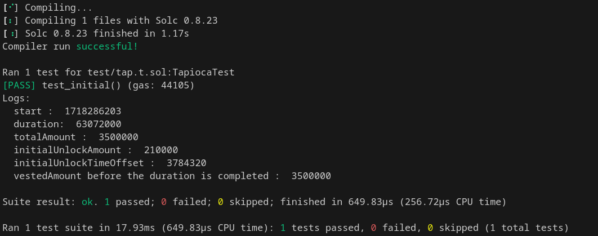

## Title: user tokens will be fully vested before the duration,incorrect logic implementation

### severity
 Med

### Description

#### vulnerability details

The _vested function in the Vesting contract allows user tokens to be fully vested 143 days earlier than the intended duration (4 years) due to the application of the __initialUnlockTimeOffset. This effectively reduces the vesting duration

#### Impact
 tokens will be fully vested before the duration

### Proof Of Concept

```
below is the poc showing the issue with the example of Early Supports

Early Supporters
totalAmout = 3,500,000 TAP
initial unlock = 210,000 TAP
duration = 2 years

here early supports receive tokens before the completion 2 years
```

```
// SPDX-License-Identifier: UNLICENSED
pragma solidity 0.8.23;

import "forge-std/Test.sol";
//import "../src/Vesting.sol";


contract TapiocaTest is Test{


    //Early Supporters:
    //totalAmout = 3,500,000 TAP
    //initial unlock = 210,000 TAP
    //duration = 2 years

    uint256 public start = 1718286203;//current timestamp
   
    uint256 public  cliff = 0;
    
    uint256 public duration = 2*365 days;//duration of 4 years

    address public owner = address(123);//owner of the contract

    uint __initialUnlockTimeOffset = 0; //update in test_initial function

    uint totalAmount = 3500000;// 3,500,000 TAP
    uint initialUnlockAmount = 210000;// 210,000 TAP


    
    function _computeTimeFromAmount(uint256 _start, uint256 _totalAmount, uint256 _amount, uint256 _duration)
        public
        pure
        returns (uint256)
    {
        return _start - (_start - ((_amount * _duration) / _totalAmount));
    }


        function _vested(uint256 _totalAmount) internal view returns (uint256) {
        uint256 _cliff = cliff;
        uint256 _start = start;
        uint256 _duration = duration;

        if (_start == 0) return 0; // Not started

        if (_cliff > 0) {
            _start = _start + _cliff; // Apply cliff offset
            if (block.timestamp < _start) return 0; // Cliff not reached
        }

        if (block.timestamp >= _start - __initialUnlockTimeOffset + _duration) return _totalAmount; // Fully vested

        _start = _start - __initialUnlockTimeOffset; // Offset initial unlock so it's claimable immediately
        return (_totalAmount * (block.timestamp - _start)) / _duration; // Partially vested
    }

    function test_initial() public{

        console.log("start : ",start);
        console.log("duration: ",duration);
        console.log("totalAmount : ",totalAmount);
        console.log("initialUnlockAmount : ",initialUnlockAmount);
        
        uint  initialUnlockTimeOffset = _computeTimeFromAmount(start, totalAmount, initialUnlockAmount, duration);
        console.log("initialUnlockTimeOffset : ", initialUnlockTimeOffset);
        __initialUnlockTimeOffset =  initialUnlockTimeOffset;


        vm.warp(start+687 days);//this issue is because in _vested function `_start = _start - __initialUnlockTimeOffset;` is applied ,this is pratically reducing the duration by __initialUnlockTimeOffset days.i.e no need to wait for 2 years for the tokens to be fully available
        uint vestedAmount = _vested(totalAmount);
        console.log("vestedAmount before the duration is completed : ",vestedAmount);//here users tokens will be fully claimable berfore the completion of the duration i.e 2 years
        

        //here early supportors will be able to claim the tokens before the 2 years of duration

    }
}
```
-> forge test --match-test test_initial -vvv

